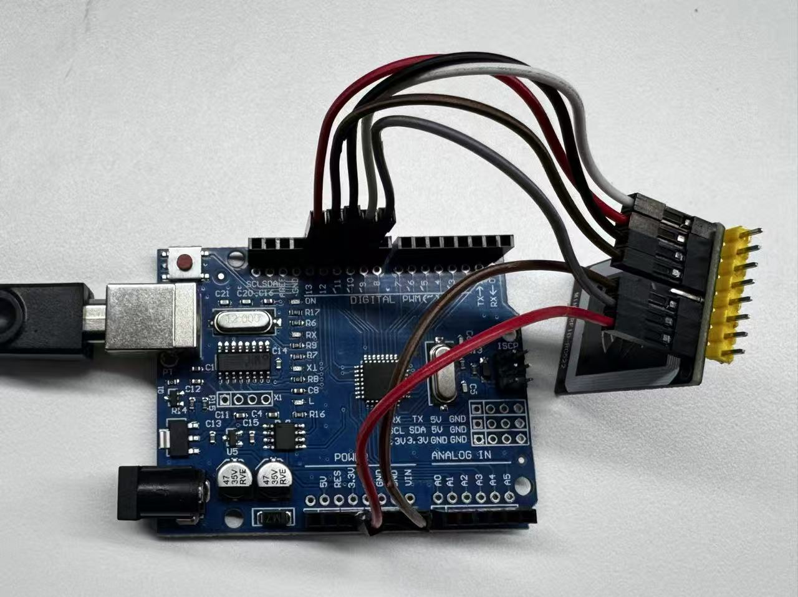
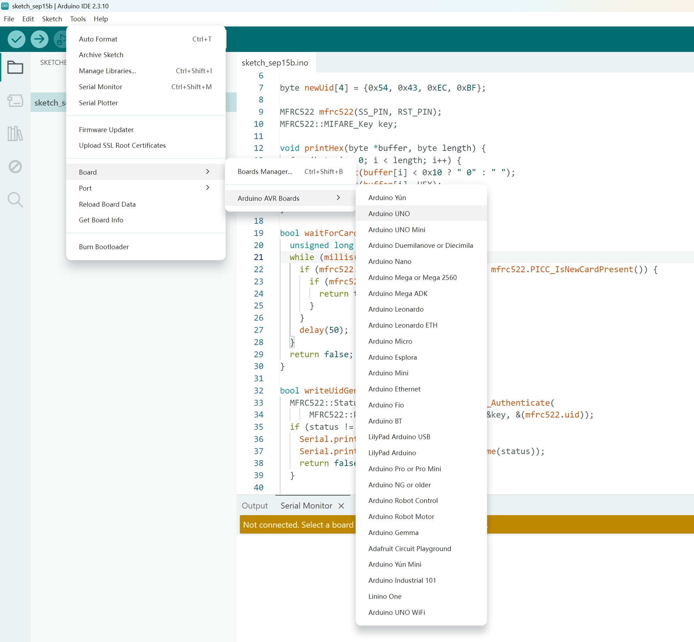
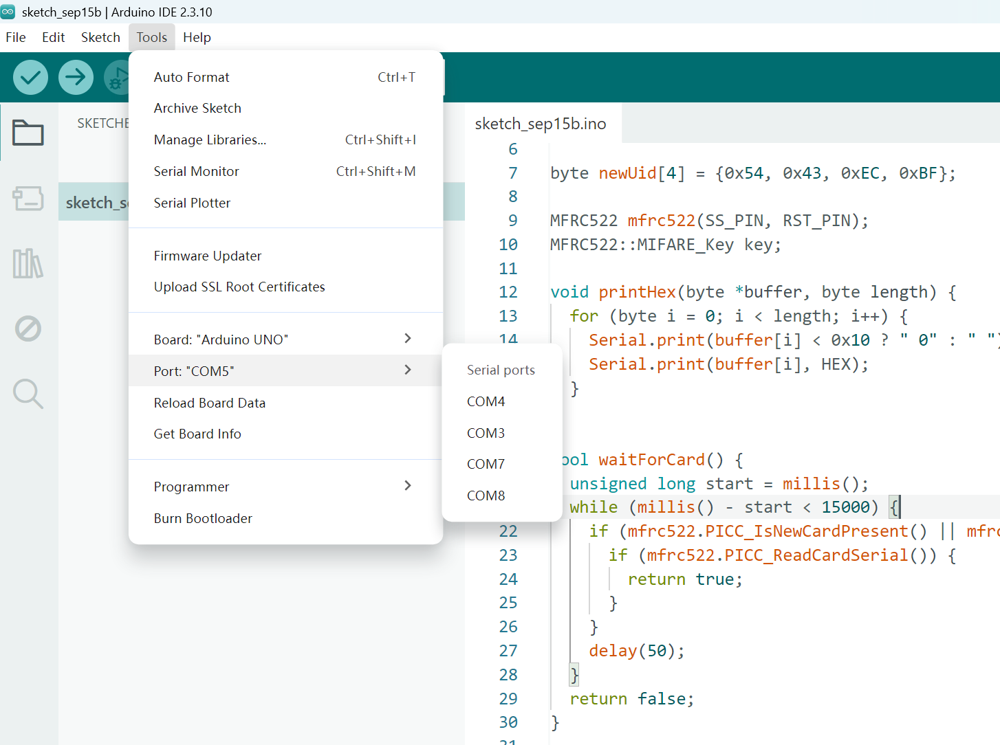

# 项目硬件准备

这是项目开源前的第一批硬件清单，先用于记录采购入口和基础硬件组成。

> 说明：淘宝短链可能需要在淘宝客户端或浏览器中打开。表格中的商品图用于硬件识别参考，链接仍保留为对应的淘宝商品链接；实际规格、库存和价格请以商品页当前信息为准。

| 序号 | 硬件用途 | 商品编号 | 商品名称 | 淘宝链接 | 商品图 | 备注 |
| --- | --- | --- | --- | --- | --- | --- |
| 1 | NFC / 门禁卡介质 | HU926 | 超薄 NFC 手机门禁卡贴 IC 滴胶卡复刻卡 CUID 空白卡复制卡电梯卡门卡 | [打开淘宝商品](https://e.tb.cn/h.8HiPHEIW1Ie9Se2?tk=F1EXTQQ5aES) |  | 用于 NFC / RFID 卡片读写与测试 |
| 2 | 模块与开发板接线 | CZ005 | 杜邦线 母对母 / 公对公 / 公对母 10 / 15 / 20 / 30 / 40 cm 连接线 40P 彩色排线 | [打开淘宝商品](https://e.tb.cn/h.8sSKBskwkLz95sS?tk=d1B4TQQ56KV) |  | 建议根据模块接口准备不同长度和端子组合 |
| 3 | USB 外设数据连接 | CZ001 | USB2.0 打印机数据线高速方口连接转接线，USB A 公对母，带屏蔽磁环 zave | [打开淘宝商品](https://e.tb.cn/h.8HiOXiK4CpNORCg?tk=AUx9TQQgcum) |  | 用于 USB Type-A 与 USB Type-B 设备之间的数据连接 |
| 4 | 13.56 MHz RFID 读卡 | CZ321 | MFRC-522 RC522 RFID 射频 IC 卡感应模块读卡刷卡，送 S50 复旦卡 PN532 | [打开淘宝商品](https://e.tb.cn/h.8sSJT6o17CTNK5y?tk=o3lXTQQTpKy) |  | 常见 SPI 接口 RFID 读卡模块，适合与 Arduino 配合测试 |
| 5 | 项目主控开发板 | CZ007 | zave 适用 Arduino Nano UNO 开发板套件 R3 改进版 ATmega328P 单片机 | [打开淘宝商品](https://e.tb.cn/h.8udbibh7TAbVOjM?tk=TewSTQQTAGj) |  | 用于运行项目固件并控制 RFID / NFC 相关模块 |

## A. 硬件准备检查

- [ ] NFC / CUID 卡片或卡贴
- [ ] 40P 杜邦线
- [ ] USB A 公对母数据线
- [ ] RC522 RFID 读卡模块
- [ ] Arduino Nano / ATmega328P 开发板
- [ ] 确认开发板电压、接口定义和模块接线方式
- [ ] 确认项目涉及的卡片读写行为符合当地法律、设备管理规定和授权范围

## B. RC522 与 Arduino Uno 接线方式

左侧为 RFID-RC522 引脚，右侧为 Arduino Uno 引脚。

| RFID-RC522 引脚 | Arduino Uno 引脚 |
| --- | --- |
| RST | 9 |
| SDA (SS) | 10 |
| MOSI | 11 |
| MISO | 12 |
| SCK | 13 |
| 3.3V | 3.3V |
| GND | GND |

> 注意：RC522 模块使用 3.3V 供电，请以具体模块规格为准，不要默认接入 Uno 的 5V。

### 接线示意图



> 接线确认无误后，如果读卡模块仍然异常，可以先断电检查并轻按模块或接线端子，临时确认是否存在接触不良。测试时应避免带电移动导线或让相邻引脚短路；更稳定的做法是重新插紧杜邦线，或对接线进行焊接固定。

## C. 下载 Arduino IDE 并配置开发板和端口

### 1. 下载并安装 Arduino IDE

从 [Arduino 官方软件下载页面](https://www.arduino.cc/en/software) 下载 Arduino IDE 2.x 并完成安装。

本项目使用 Arduino Uno 开发板，建议使用 USB 数据线将开发板连接到电脑。仅支持充电的 USB 线无法完成程序上传。

### 2. 选择开发板

打开 Arduino IDE，在顶部菜单中依次选择：

```text
Tools
└── Board
    └── Arduino AVR Boards
        └── Arduino UNO
```

如菜单中没有 `Arduino AVR Boards`，先打开 `Tools → Board → Boards Manager...`，搜索并安装 `Arduino AVR Boards`。



### 3. 选择端口

开发板连接电脑后，在顶部菜单中依次选择：

```text
Tools
└── Port
    └── 选择开发板对应的 COM 端口
```

截图中的端口是 `COM5`，但每台电脑分配的端口号可能不同。建议先拔下开发板，再重新插入，观察 `Tools → Port` 菜单中新出现的端口，然后选择它。



配置完成后，Arduino IDE 的菜单中应显示类似以下信息：

```text
Board: "Arduino UNO"
Port: "COMx"
```

其中 `COMx` 是电脑实际分配给开发板的端口号。

如果 `Tools → Port` 中没有任何端口，请检查 USB 数据线、USB 接口和开发板电源指示灯；兼容版开发板还可能需要安装对应的 USB 转串口驱动。

### 4. CH435 USB 转串口端口配置

如果你的兼容版 Arduino Uno 使用 CH435 作为 USB 转串口芯片，端口配置方法如下：

1. 使用 USB 数据线连接开发板和电脑。
2. 打开 Windows **设备管理器**，在“端口（COM 和 LPT）”中找到新出现的 USB 串口设备，并记下对应的 `COMx` 端口号。
3. 打开 Arduino IDE，选择 `Tools → Port → COMx`。
4. 开发板类型仍然选择 `Arduino UNO`，CH435 只负责 USB 与 Arduino 串口之间的通信，不需要在开发板列表中单独选择。

如果设备管理器中没有出现新的 COM 端口，请检查 CH435 对应驱动、USB 数据线和开发板供电。建议先拔下开发板，再重新插入，通过端口列表中新增或消失的项目确认正确端口。

参考教程：

- [Arduino 官方：在 Arduino IDE 中选择开发板和端口](https://support.arduino.cc/hc/en-us/articles/4406856349970-Select-board-and-port-in-Arduino-IDE)
- [沁恒官方：USB 转串口芯片 Windows 串口驱动安装](https://www.wch.cn/)

### 5. 安装 MFRC522 库

本项目代码需要使用 `MFRC522` 库，否则编译时可能出现 `MFRC522.h: No such file or directory` 等头文件缺失错误。该库可以直接通过 Arduino IDE 内置的库管理器安装，不需要手动复制头文件。

安装步骤：

1. 打开 Arduino IDE。
2. 选择 `Sketch → Include Library → Manage Libraries...`，也可以点击左侧的库管理器图标。
3. 在搜索框中输入 `MFRC522`。
4. 找到名称为 `MFRC522`、作者显示为 `GithubCommunity` 的库后点击 **Install**。建议确认库名称和作者信息，避免安装到同名的其他库。
5. 安装完成后重启 Arduino IDE，再重新编译项目。

安装后，代码中的以下头文件就可以被正常识别：

```cpp
#include <MFRC522.h>
```

参考教程：

- [Arduino 官方：在 Arduino IDE 2 中安装库](https://docs.arduino.cc/software/ide-v2/tutorials/ide-v2-installing-a-library)
- [Arduino IDE 添加库文件教程（CSDN）](https://blog.csdn.net/2301_80596293/article/details/158538480)

### 6. 读取卡片 UID

项目提供了一个用于检查 RC522 读卡模块并读取卡片 UID 的示例程序：

- [read/read.ino](read/read.ino)

将开发板、RC522 模块和电脑连接好后，在 Arduino IDE 中打开 `read/read.ino`，确认开发板选择为 `Arduino UNO`，端口选择为开发板对应的 `COMx`，然后点击上传。

上传完成后，打开 **Serial Monitor（串口监视器）**，波特率选择 `9600 baud`。

如果串口监视器中出现：

```text
Firmware Version: 0x92 = v2.0
```

说明 RC522 读卡模块已经能够被 Arduino 正常识别。此时将已获授权的校园卡放在 RC522 模块附近，程序会自动读取卡片信息，并输出类似：

```text
UID: XX XX XX XX
Card Type: MIFARE 1K
```

其中 `UID` 是本次读取到的卡片标识信息，可在串口监视器中记录。不同卡片的 UID 长度可能不同，实际输出以串口监视器显示为准。

如果没有输出 `Firmware Version`，或显示版本为 `0x00`、`0xFF`，请重新检查 RC522 的接线、`3.3V` 供电、开发板型号、端口和 `MFRC522` 库安装情况。

> 请只读取和记录自己拥有或获得明确授权的卡片信息，并遵守校园管理规定和当地法律。

### 7. 安全写入测试数据

本项目不提供改写卡片 UID、修改 Block 0 或复制校园卡/门禁卡身份的程序。

如果需要验证 RC522 的写卡功能，可以使用安全示例：

- [write-safe/write-safe.ino](write-safe/write-safe.ino)

这个示例只向自己拥有的 MIFARE Classic 测试卡的普通数据块 `Block 4` 写入 `ZGC-CUID TEST` 测试文本，然后回读验证。它不会修改 UID，也不会写入卡片制造商块 `Block 0`。

使用方法：

1. 在 Arduino IDE 中打开 `write-safe/write-safe.ino`。
2. 选择 `Arduino UNO` 和正确的 `COMx` 端口。
3. 上传程序。
4. 打开串口监视器，波特率选择 `9600 baud`。
5. 将已授权的 MIFARE Classic 测试卡放在 RC522 附近。
6. 观察 `Write successful.` 和 `Block 4 data:` 输出。

> 请勿使用校园卡、门禁卡或其他非本人所有的凭证进行写入、复制或身份修改。

## D. 致谢

- 感谢 [CSDN：arduino IDE 添加库文件](https://blog.csdn.net/2301_80596293/article/details/158538480)，本文关于 Arduino IDE 库安装和 `MFRC522` 库配置的部分内容参考了该教程。
- 感谢 [Arduino 官方文档](https://docs.arduino.cc/)，为 Arduino IDE、开发板、端口和库管理相关说明提供参考。
- 感谢 [MFRC522 Arduino RFID Library](https://github.com/miguelbalboa/rfid) 及其维护者，为 RC522 读卡示例提供库支持。

本文内容用于学习和合法授权范围内的硬件实验，请遵守相关设备管理规定和当地法律。
